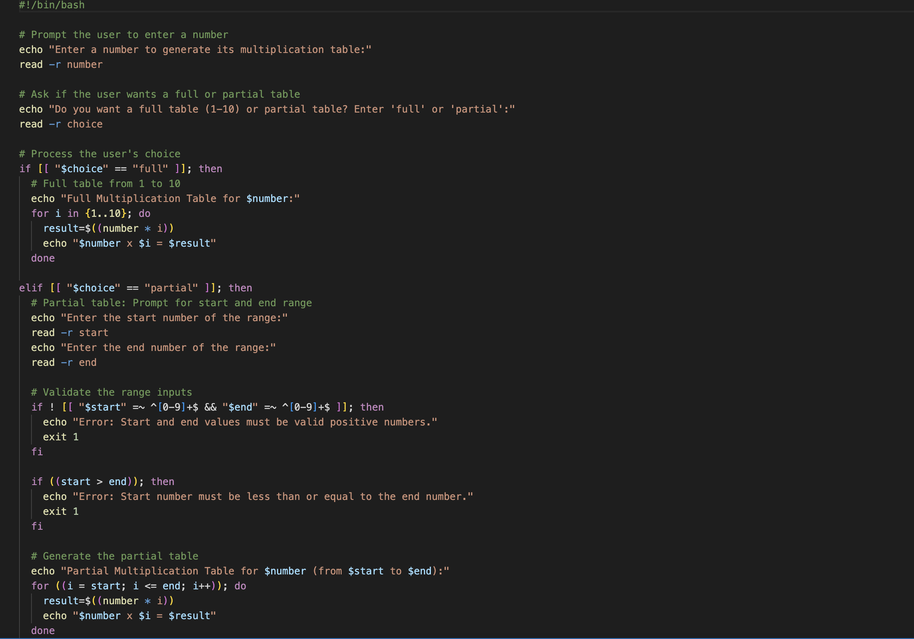
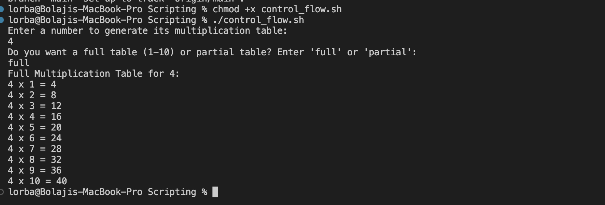

# Capstone Project - Linux Shell Scripting

## Bash Script For Generating a Multiplication Table:

* **Project Discription:**

Creating a bash script that generate a multiplication table and the script must prompt the user to enter a number for which the multiplication table will be generated. Ask if they want a full table or partial table, if partial prompt for the start and end numbers of the range.

* **Script:** Control_flow.sh

**Steps to Create and Run the Script:**

**a. Create the Script File:** `touch control_flow.sh`

**b. Edit the File:** `vim control_flow.sh`

b.i. Using `#!/bin/bash` to begin the script writting followed by Prompting the user to enter a number 
* `echo "Enter a number to generate its multiplication table:" read -r number`

b.ii. Ask if the user wants a full or partial table 
* `echo "Do you want a full table (1-10) or partial table? Enter 'full' or 'partial':" read -r choice`

b.iii. Process the user's choice:
  ### Full table from 1 to 10
* `if [[ "$choice" == "full" ]]; then`
* `echo "Full Multiplication Table for $number:"`
* `for i in {1..10}; do`
* `result=$((number * i))`
* `echo "$number x $i = $result"`
 
### Partial table: Prompt for start and end range
* `elif [[ "$choice" == "partial" ]]; then`
* `echo "Enter the start number of the range:"`
* `read -r start`
* `echo "Enter the end number of the range:"`
* `read -r end`
  `done`

b.iv. Validate the range inputs:
* `if ! [[ "$start" =~ ^[0-9]+$ && "$end" =~ ^[0-9]+$ ]]; then`
* `echo "Error: Start and end values must be valid positive numbers."`
* `exit 1`
* `fi`

* `if ((start > end)); then`
* `echo "Error: Start number must be less than or equal to the end number."`
* `exit 1`
* `fi`

 b.v. Generate the partial table:

* `echo "Partial Multiplication Table for $number (from $start to $end):"`
* `for ((i = start; i <= end; i++)); do`
* `result=$((number * i))`
* `echo "$number x $i = $result"`
* `done`

c. Make the Script Executable: We need to run the below command to make our script executable.

`chmod +x control_flow.sh`

d. Running the Script: The below command will be run on our terminal to perform the intending purpose of the writting scripts.

`./control_flow.sh`

### Outcome of the Scripts

* Full Table:

Partial Table:

